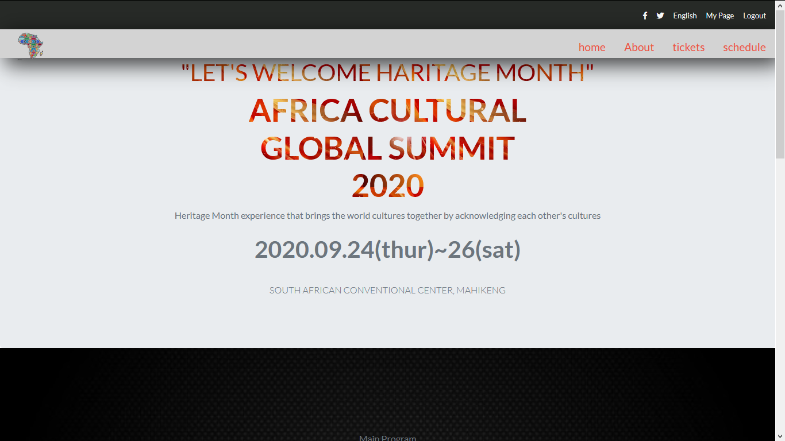

# A CONFERENCE page

This project is based on The Odin Project and Microverse solo project. It involves cloning a page that matches the look of a [CONFERENCE PAGE page](https://www.behance.net/gallery/29845175/CC-Global-Summit-2015)

This is a solo project carried out by Tshepo David Molefe , as part of the PROJECT: Conference page. This project is aimed at learning about linking to internal web pages.

## Built With
- Bootstrap
- HTML5
- CSS3
- Google Icons
- images
- Fonts

## Live Demo

[Live Demo Link](https://raw.githack.com/TSHEPO-CLOUD/Conference-Page-Capstone/conference/index.html)

## Getting Started

**To get your own copy of our project clone the repository to your local machine.**

## Authors

👤 **Tshepo Molefe**

- Github: [@tshepo](https://github.com/TSHEPO-CLOUD)
- Twitter: [@tshepo](https://twitter.com/tshepomolefe)
- Linkedin: [TSHEPO MOLEFE](https://linkedin.com/tshepo-molefe)

## 🤝 Contributing

Contributions, issues and feature requests are welcome!

Feel free to check the [issues page](https://github.com/TSHEPO-CLOUD/Conference-Page-Capstone/issues).

## Show your support

Give a ⭐️ if you like this project!

## 📝 License

This project is [MIT](lic.url) licensed.